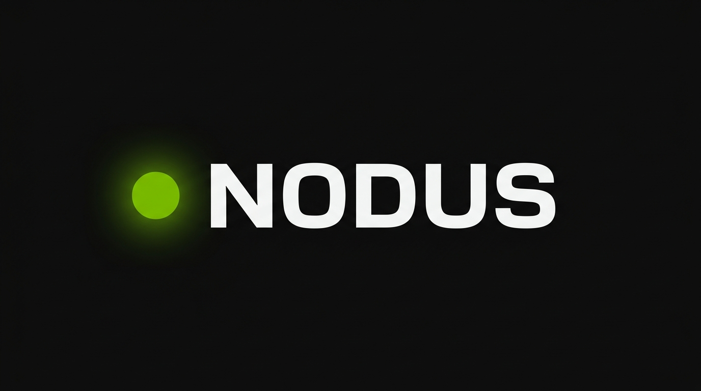

<div align="center">



<br/>


<br/>

### *"Describe meaning, not geometry."*

**A Python DSL where `user >> api >> db` becomes a diagram —<br/>no drag, no click, no config file.**

</div>

---

## ⚡ What is Nodus?

Most diagramming tools ask you to **draw**.  
Nodus asks you to **say**.

You describe relationships in plain Python. Nodus renders them into a live, interactive visual canvas in the browser — automatically, without you touching a single pixel.

This is not a charting library. It is not a wrapper around D3.  
It is a **declarative visual language** built on top of Python, where the code *is* the diagram.

---

## 🔴 The Problem

Every tool that exists today puts the burden of layout on **you**.

| Tool | What you spend time on |
|---|---|
| Figma / Miro | Moving boxes around (45 min+) |
| Lucidchart | Connecting arrows manually (20 min+) |
| Mermaid | Fighting config syntax (10 min+) |

None of them let you think about **what the system means**.  
They all force you to think about **where things are**.

**Nodus inverts this.**

---

## 🟢 The Solution

```python
import nodus as ndu

canvas = ndu.canvas()
canvas.node("User") >> canvas.node("API") >> canvas.node("Database")
```

Write it. Run it. Your diagram is in the browser.

---

## 🧩 What It Looks Like Today

```python
import nodus as ndu

# A full-screen canvas, divided into 3 columns
canvas = ndu.canvas()
canvas.columns(3)
left, middle, right = canvas[0], canvas[1], canvas[2]

# Add a node with an ID you can reference
middle.node("Internet", bg="yellow", id="internet_node")

# Build a rich panel on the right
panel = right.block()
panel.heading("How It Works")
panel.text("Data flows from client to server...")
panel.button("Learn More")

# A node block that can be connected to
info = right.node_block(id="right_info")
info.node("How Internet Works")

# Connect two elements with a styled line
ndu.connect("internet_node", "right_info", line="arrow")
```

Nodus writes clean, standards-compliant HTML + CSS to disk. Open it. That's your diagram.

---

## 🗺️ Roadmap

> **Rule:** No version advances without working, runnable code. No exceptions.

| Version | Label | What It Proves | Status |
|---|---|---|---|
| **V0.1** | `Concept` | Python → boxes + arrows in a browser | 🟡 In Progress |
| **V0.2** | `Serialization` | Python scene graph → JSON → JS renderer | ⬜ Queued |
| **V0.3** | `Real Renderer` | Local dev server + SVG, screenshot-able | ⬜ Queued |
| **V0.4** | `Interaction` | Drag nodes, pan/zoom, layout ≠ semantics | ⬜ Queued |
| **V0.5** | `Styling` | Per-node style, themes, chainable API | ⬜ Queued |
| **V0.6** | `Groups` | `with canvas.frame("Auth"):` context manager | ⬜ Queued |
| **V0.7** | `Layout Engine` | Real hierarchical layout, no more fixed positions | ⬜ Queued |
| **V0.8** | `Animation` | Animated edges showing data flow | ⬜ Queued |
| **V0.9+** | `Intelligence` | AST → diagram, LLM → DSL → diagram | 🔭 Horizon |

> 🎯 **The critical milestone is V0.3** — real, demo-able, shareable. Ship that, then decide what comes next.

---

## 🧠 Design Philosophy

**`[1]` Substance before polish.**  
No docs until V0.3 runs. No framework claims until V0.1 ships. *Working code before the next version, always.*

**`[2]` Separation of concerns, visibly.**  
Presentation state (where things are on screen) lives in the browser. Semantic state (what connects to what) lives in Python. These are not the same thing. Nodus makes that distinction real.

**`[3]` The DSL is the product.**  
Not the renderer. Not the server. The moment someone writes `user >> api >> db` and sees it rendered — *that* is the thing worth building.

---

## 🎨 Visual System

Nodus has a defined, intentional aesthetic — dark, high-contrast, technical.

| Token | Value | Usage |
|---|---|---|
| Background | `#0a0a0a` | Base canvas — near-black, not pure black |
| Primary accent | `#76B900` | CTAs, active states, edge lines |
| Primary text | `#e5e5e5` | All main content |
| Secondary text | `#8a8a8a` | Labels, captions, metadata |
| Code font | `JetBrains Mono` / `Fira Code` | All code blocks |
| UI font | `Inter` / `Space Grotesk` | Headings, navigation |
| Hover glow | `box-shadow: 0 0 20px rgba(118,185,0,0.3)` | Interactive elements |

This isn't decoration. The visual identity is part of the statement: Nodus is built by someone who thinks about systems the same way they think about design.

---

## 🗂️ Repository Structure

```
Nodus/
├── working/
│   ├── core.py          # Canvas, Node classes + HTML/CSS generation engine
│   ├── demo.py          # Live usage example
│   ├── index.html       # Generated output (browser target)
│   └── style.css        # Generated + design token styles
├── support/
│   ├── VisualCanvas_Roadmap.md   # Full versioned build plan
│   ├── demo.txt                  # API syntax reference / scratchpad
│   └── License.md                # Source-available license terms
└── Readme.md
```

---

## 📜 License

Nodus is **source-available**, not open-source.

```
✅ Personal use          ✅ Educational use       ✅ Research
✅ View & study code     ✅ Fork to contribute    ❌ Redistribute
❌ Commercial use        ❌ Resell / sublicense   ❌ Independent forks
```

See [`support/License.md`](support/License.md) for full terms.

---

## 📡 Status & Contributing

This is **active, early-stage development**. The architecture is being proven. The DSL is being designed by running it.

- 👁️ **Follow the build**: Watch the repo
- 🔧 **Contribute**: Open a PR to this repository only  
- 💼 **Commercial use**: Reach out directly

---

<div align="center">

*Built by Shubham — 2026*

`●` *A node. A point. A beginning.*

</div>
